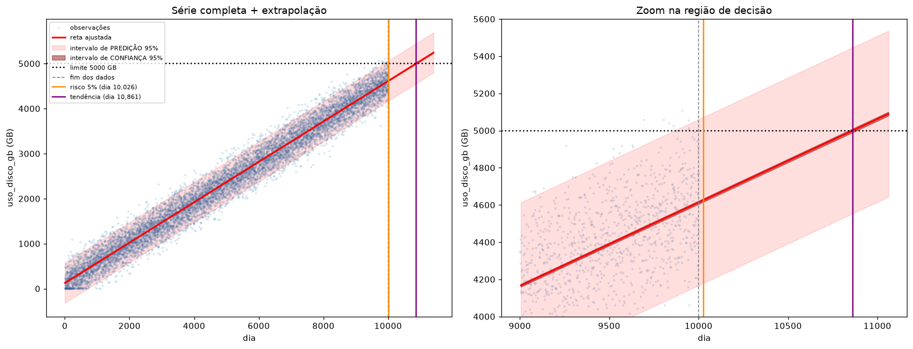

# IC — Introdução aos Paradigmas de Machine Learning

Iniciação Científica: estudo, implementação própria e avaliação de algoritmos
clássicos de Machine Learning, comparando a implementação manual com a
biblioteca de referência (scikit-learn) em cada bloco.

Imagens em [images/](images/).

## Regressão Linear

**Capacity Planning: previsão de esgotamento de disco** —
[`capacity_planning.ipynb`](capacity_planning.ipynb)

Regressão linear simples sobre 10.000 medições diárias de ocupação de disco
([`monitoramento_disco_10k_v2.csv`](monitoramento_disco_10k_v2.csv)), para
estimar quando o servidor atinge o limite operacional de 5.000 GB.
Enunciado: [`Atividade_Regressao_Linear_Simples.pdf`](Atividade_Regressao_Linear_Simples.pdf).

Modelo ajustado por mínimos quadrados, implementado à mão e conferido contra
`sklearn.linear_model.LinearRegression`:

```
ŷ = 127,65 + 0,448590·x        R² = 0,9700    RMSE = 228 GB
```

**O resultado central** é a distância entre duas respostas à mesma pergunta:

| Critério | Dia | Margem a partir do fim dos dados |
|---|---|---|
| A **tendência** atinge 5.000 GB | 10.861 | 861 dias |
| O **percentil 95** atinge 5.000 GB | 10.026 | 26 dias |

A resposta algébrica direta (inverter a equação) descreve a ocupação *média* e
subestima o risco operacional em uma ordem de grandeza — nove dias da própria
amostra já ultrapassaram o limite. A diferença entre intervalo de confiança e
intervalo de predição é o que separa um exercício de uma recomendação de
infraestrutura utilizável.



Dois achados fora do enunciado:

- **Censura nos dados** — 101 registros travados em exatamente 10,00 GB
  (dias 14 a 1.102), que aparecem no gráfico de resíduos como uma reta
  descendente, já que `e = 10 − ŷ`. Análise de sensibilidade: excluir a região
  altera `β̂₁` em 0,21%.
- **Validação preditiva** — nos dias 9.501 a 10.000, a taxa de estouro prevista
  pelo modelo foi 1,76% contra 1,80% observada.

Diagnóstico completo de resíduos (homocedasticidade, normalidade, ausência de
curvatura) e comparação com regressão polinomial de graus 2 e 3 estão no
notebook. Figuras em [`images/`](images/).

**Limitação assumida:** a autocorrelação dos resíduos não foi testada. Séries de
monitoramento costumam ter dias correlacionados, o que tornaria os intervalos
otimistas — Durbin-Watson é o próximo passo natural.


## Regressão Logística

_(em andamento)_
